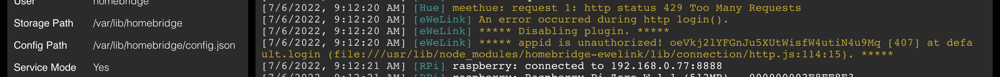

# a **PATCH** for `appid unauthorized` error on `homebridge-ewelink@8.15`

[Related issue from bwp91/homebridge-ewelink](https://github.com/bwp91/homebridge-ewelink/issues/385)

# Original plugin
[`homebridge-ewelink` plugin](https://github.com/bwp91/homebridge-ewelink) by @bwp91  
[latest release available with `node v12`, `homebridge-ewelink@8.15`](https://github.com/bwp91/homebridge-ewelink/releases/tag/v8.15.0)
- Which can be installed using command below: 
  ```
  npm install -g homebridge-ewelink@8.15
  ```


# Description
- This is a patch for `appid unauthorized` error which occurs after `7/6/2022`  
- Tested on version `homebridge-ewelink@8.15` which is lastest release compatible with `node v12`  
- Tested on `homebridge-ewelink@8.15` ONLY, cannot sure any version below is compatible
- Please use it at your own risk

# How-to
- Install your plugin, move into your global `node_modules` directory. I will call it **`A`**
  - It was `/usr/lib/node_modules` for me
- copy `node_modules` directory in [patch](/patch)
- paste(and overwrite) it over **`A`**
- test it by running `homebridge`
- read [this](https://github.com/bwp91/homebridge-ewelink/releases/tag/v10.0.0) which is about _logged out_ issue before continue, and you are good to go

# Tested on
- iPhone 7
- iOS 14.8.1 jailbroken with checkra1n
- using [`Node`](https://www.ios-repo-updates.com/repository/bingner-elucubratus/package/nodejs/) from _bingner_
- `homebridge@1.4.1` & `homebridge@1.5.0(latest)` (both tested)


# References
- [Commit 72d83fa1b3402fc9d854d6d9e6670506f3f7a393](https://github.com/bwp91/homebridge-ewelink/commit/72d83fa1b3402fc9d854d6d9e6670506f3f7a393)  
- [Commit 0967970e7aae8e843cb77b756731041f029f6a26](https://github.com/bwp91/homebridge-ewelink/commit/0967970e7aae8e843cb77b756731041f029f6a26)

Modification of these commits